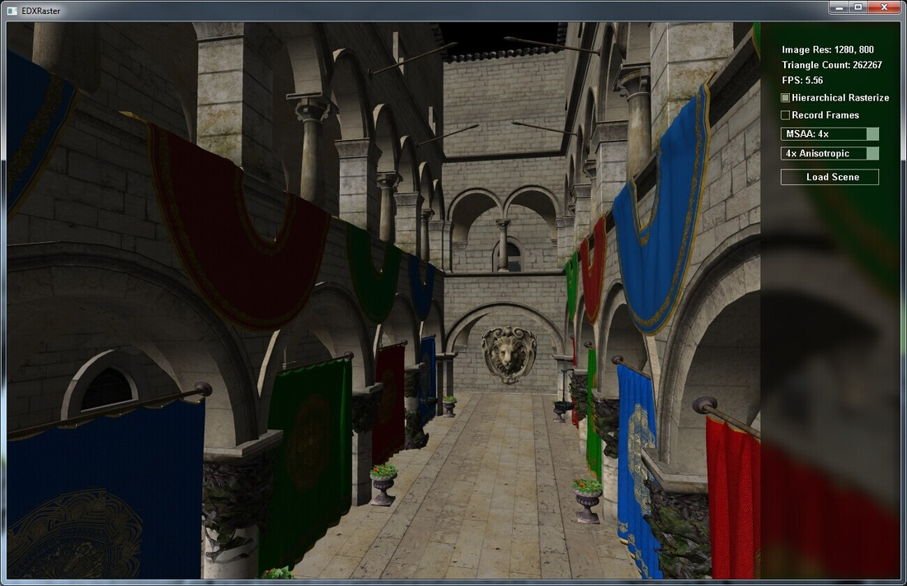

  
**EDXRaster** is an highly optimized software renderer based on rasterization, independently developed by [Edward Liu](http://behindthepixels.info/). This renderer is written with C++ and SSE and is highly optimized. Most of the D3D11 pipeline is implemented.

The source code of EDXRaster is highly self-contained and does not depend on any external library other than [EDXUtil](https://github.com/EDXGraphics/EDXUtil), which is a utility library developed by Edward Liu.

EDXRaster is currently built and tested only on Windows platform. Developer using Visual Studio 2015 should be able to build the source code immediately after syncing. Porting to Linux or macOS should not be difficult since it there is no external dependency.

## Technical Details

- The rasterization was parallelized on both thread level and instruction level. Triangles are first binned into 16x16 tiles, before rasterized hierarchically onto 8x8 tiles and then onto pixel level. 
- Hierarchical rasterization is done the same way in the [larrabee document](https://software.intel.com/en-us/articles/rasterization-on-larrabee). 4 wide SSE were used to rasterize a triangle to 4 pixels at a time.
- Basic blinn-phong shading is supported and also accelerated with SSE.
- Key data structure sizes and layouts are highly tuned to reach high performance.
- Implemented pipeline stages include
  - Vertex Transformation
  - Homogeneous Clipping
  - Rasterization
  - Perspective Corrected Interpolation
  - Pixel Shading
  - Depth Test
 
 
## 64 Bit Windows Binary
[EDXRaster](assets/EDXRaster.exe)
